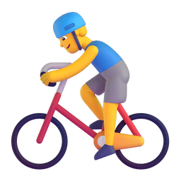
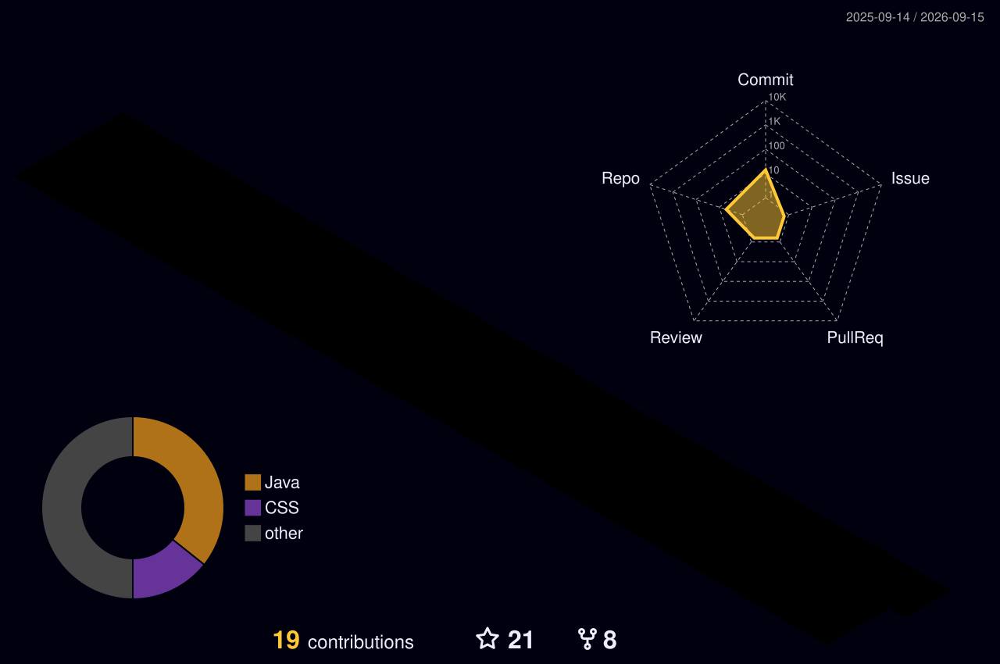

<div align="center">

[;Lukias+%E7%A5%9D%E6%82%A8%E4%BB%8A%E5%A4%A9%E6%84%89%E5%BF%AB!&center=true&size=27)](https://git.io/typing-svg)

<picture>
  <source media="(prefers-color-scheme: dark)" srcset="./assets/images/coding.gif" />
  <source media="(prefers-color-scheme: light)" srcset="./assets/images/developer.svg" height="225px" />
  
</picture>

<div>&nbsp;</div>

<div>
  <a href="https://github.com/cecil-luke"></a>&emsp;
  <a href="https://x.com/lukias64"></a>&emsp;
  <a href="https://lukias-blog.cc.cd/"></a>&emsp;
  <a href="mailto:cecil-luke@foxmail.com"></a>&emsp;
  <!-- visitor -->
  &emsp;
  <!-- wakatime -->
  <!-- <a href="https://wakatime.com/@cecil-luke"></a> -->
</div>

<picture>
  <source media="(prefers-color-scheme: dark)" srcset="./profile-snake-contrib/github-contribution-grid-snake-dark.svg" />
  <source media="(prefers-color-scheme: light)" srcset="./profile-snake-contrib/github-contribution-grid-snake.svg" />
  
</picture>

</div>


#  🙋 Hello

<table>

<tr><td>

### 🤺 About Me


<p>&emsp;&emsp;嗨，你好，我是 Lukias。一名全栈开发工程师，热爱摄影、旅游、爬山。</p>
<p>&emsp;&emsp;热爱计算机科学和 IT 互联网事业，希望用技术创造价值，用代码改变世界。</p>
<p>&emsp;&emsp;我们正在让这个世界变得更加美好，通过代码的重复使用和延展构建完美体系。</p>
<p>&emsp;&emsp;<strong>We're making the world a better place. Through constructing elegant hierarchies for maximum code reuse and extensibility.</strong></p>

</td></tr>

<tr><td>

### 📃 Recent Blog


<!-- feed start -->
- Aug 16 - [博客文章优化-测试](https://lukias-blog.cc.cd/blog/Test)
- Jul 17 - [技术规划](https://lukias-blog.cc.cd/blog/plan-b)
- Jul 13 - [桌面应用小记](https://lukias-blog.cc.cd/blog/desktop-note)
- May 28 - [开发总结](https://lukias-blog.cc.cd/blog/dev-summary)
- May 09 - [自动工具](https://lukias-blog.cc.cd/blog/auto-tool)
<!-- feed end -->

</td></tr>

<tr><td>

### 📊 WakaTime

<!--START_SECTION:waka-->


**I'm an Early 🐤** 

```text
🌞 Morning                88 commits          ████░░░░░░░░░░░░░░░░░░░░░   15.47 % 
🌆 Daytime                245 commits         ███████████░░░░░░░░░░░░░░   43.06 % 
🌃 Evening                190 commits         ████████░░░░░░░░░░░░░░░░░   33.39 % 
🌙 Night                  46 commits          ██░░░░░░░░░░░░░░░░░░░░░░░   08.08 % 
```
📅 **I'm Most Productive on Thursday** 

```text
Monday                   99 commits          ████░░░░░░░░░░░░░░░░░░░░░   17.40 % 
Tuesday                  82 commits          ████░░░░░░░░░░░░░░░░░░░░░   14.41 % 
Wednesday                88 commits          ████░░░░░░░░░░░░░░░░░░░░░   15.47 % 
Thursday                 114 commits         █████░░░░░░░░░░░░░░░░░░░░   20.04 % 
Friday                   87 commits          ████░░░░░░░░░░░░░░░░░░░░░   15.29 % 
Saturday                 61 commits          ███░░░░░░░░░░░░░░░░░░░░░░   10.72 % 
Sunday                   38 commits          ██░░░░░░░░░░░░░░░░░░░░░░░   06.68 % 
```


📊 **This Week I Spent My Time On** 

```text
🕑︎ Time Zone: Asia/Shanghai

💬 Programming Languages: 
TypeScript               6 hrs 19 mins       ██████████████████░░░░░░░   71.85 % 
Markdown                 56 mins             ███░░░░░░░░░░░░░░░░░░░░░░   10.67 % 
JSON                     22 mins             █░░░░░░░░░░░░░░░░░░░░░░░░   04.22 % 
Text                     17 mins             █░░░░░░░░░░░░░░░░░░░░░░░░   03.23 % 
Image (png)              14 mins             █░░░░░░░░░░░░░░░░░░░░░░░░   02.70 % 

🔥 Editors: 
Cursor                   5 hrs 34 mins       ████████████████░░░░░░░░░   63.38 % 
IntelliJ IDEA            1 hr 46 mins        █████░░░░░░░░░░░░░░░░░░░░   20.17 % 
Agent                    1 hr 26 mins        ████░░░░░░░░░░░░░░░░░░░░░   16.45 % 

💻 Operating System: 
Mac                      8 hrs 48 mins       █████████████████████████   100.00 % 
```

🤖 **AI Coding This Week** 

```text
⏱ AI Coding Time: 8 hrs 47 mins (99.84%)

✍️ 4,837 lines written by AI, 3 lines written by hand (99.94% AI-written)

🔤 66,895 Input Tokens, 66,895 Output Tokens

💵 $0.54 Estimated AI Cost This Week

🧠 33 AI Sessions, 93 AI Prompts

Grok                     3,253 lines         ███████████████░░░░░░░░░░   60.88 % 
Cursor                   2,090 lines         ██████████░░░░░░░░░░░░░░░   39.12 % 

🔎 AI Coding Insights:
🤖 AI-Driven — 99.94% of written lines came from AI
📚 Verbose Prompter — average 3,475 characters per prompt
🔁 Iterative Prompter — average 3 prompts per session
🚀 High AI Trust — 0.06% of changed lines were hand-edited
```


 Last Updated on 21/09/2026 03:27:53 UTC
<!--END_SECTION:waka-->

</td></tr>

</table>


<div align="center">


<div>
  <picture>
    <source media="(prefers-color-scheme: dark)" srcset="https://readme-jokes.vercel.app/api?hideBorder&bgColor=%23121212" />
    <source media="(prefers-color-scheme: light)" srcset="https://readme-jokes.vercel.app/api?hideBorder&bgColor=%ffffff" />
    
  </picture>
</div>


<picture>
  <source media="(prefers-color-scheme: dark)" srcset="https://github-readme-streak-stats.herokuapp.com/?user=cecil-luke&theme=dark&hide_border=true" />
  <source media="(prefers-color-scheme: light)" srcset="https://github-readme-streak-stats.herokuapp.com/?user=cecil-luke&theme=light&hide_border=true" />
  
</picture>


<table>
  <tr>
    <td>
      <picture>
        <source media="(prefers-color-scheme: dark)" srcset="https://github-readme-activity-graph.vercel.app/graph?username=cecil-luke&theme=xcode&bg_color=FF000000&hide_border=true" />
        <source media="(prefers-color-scheme: light)" srcset="https://github-readme-activity-graph.vercel.app/graph?username=cecil-luke&theme=xcode&bg_color=FF000000&color=000000&hide_border=true" />
        
      </picture>
  </tr>
</table>

</div>


<div align="center" >



<div><br/></div>

<!-- <div><br/></div> -->

</div>


<div align="center" >


<!-- techstack icons -->


<br>

<!-- gif -->


<picture>
  <source media="(prefers-color-scheme: dark)" srcset="./profile-3d-contrib/profile-night-rainbow.svg" />
  <source media="(prefers-color-scheme: light)" srcset="./profile-3d-contrib/profile-gitblock.svg" />
  
</picture>

</div>


<div align="center">


<table>
  <tr>
    <td></td>
  </tr>
</table>

<table>
  <tr>
    <td></td>
    <td></td>
  </tr>
  <tr>
    <td></td>
    <td></td>
  </tr>
  <tr>
    <td></td>
    <td></td>
  </tr>
  <tr>
    <td></td>
    <td></td>
  </tr>
  <tr>
    <td></td>
    <td></td>
  </tr>
</table>


</div>

